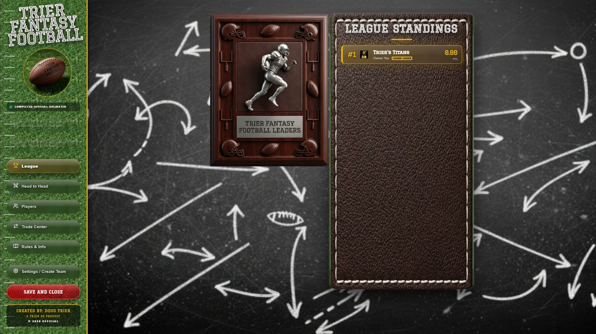
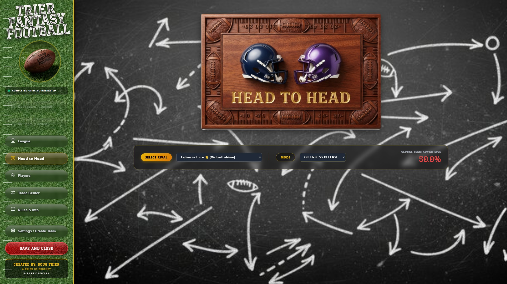
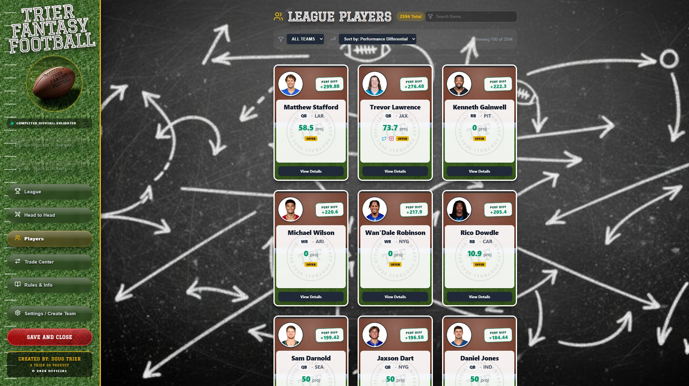
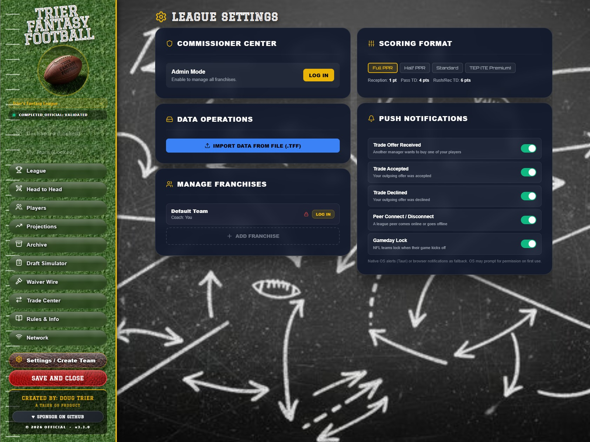

<div align="center">

# Trier Fantasy Football

**A local-first, peer-to-peer fantasy football manager — built for real commissioners who don't need the cloud.**

[](https://github.com/DougTrier/Trier_Fantasy_Football/releases)
[](https://github.com/DougTrier/Trier_Fantasy_Football/actions)
[](LICENSE)

[](https://youtu.be/M6KrnePOt8s)

*Click to watch the full demo on YouTube*

</div>

---

## What It Is

Trier Fantasy Football is a desktop fantasy football application built with **Tauri + React + TypeScript**. It runs entirely on your local network — no accounts, no cloud, no subscriptions. Peers find each other via **LAN mDNS**, authenticate via **ECDSA P-256 mutual handshake**, and sync roster state directly over **WebRTC data channels**.

This is not a wrapper around ESPN or Yahoo. It is a fully self-contained league management system with enterprise-grade security.

---

## Screenshots

<table>
  <tr>
    <td align="center">
      
      <br/><sub><b>League Standings</b></sub>
    </td>
    <td align="center">
      
      <br/><sub><b>Head to Head Matchup</b></sub>
    </td>
  </tr>
  <tr>
    <td align="center">
      
      <br/><sub><b>League Players</b></sub>
    </td>
    <td align="center">
      
      <br/><sub><b>Settings & Sideband Network</b></sub>
    </td>
  </tr>
</table>

---

## Card Flip Animation

[](https://youtu.be/iq3YG__1Euk)

*Player cards feature a tactile 3D flip animation — click to see it in action.*

---

## Features

### League Management
- Full roster management with drag-and-drop player swaps
- League standings, head-to-head matchup analysis with 0–100 advantage scoring
- Trade center with Production Points economy and escrow protection
- Commissioner admin mode with password-protected controls and game day lock overrides
- Encrypted `.tff` backup files — export and import your entire league

### Local-First P2P Networking
- **LAN peer discovery** via Rust-backed mDNS — peers appear automatically on the same network
- **Internet play** via WebSocket relay server + DHT (Trystero) fallback
- **Invite codes** for cross-network play — generate a code, share it out-of-band
- **ECDSA P-256 mutual authentication** — every peer connection goes through a 3-message cryptographic handshake before any game data flows
- **Forward-secret session encryption** — ephemeral ECDH P-256 key exchange derives a per-connection AES-GCM-256 session key; compromising long-term identity keys cannot expose past sessions
- **Deterministic event log** — every roster move is signed, deduplicated, and replayed identically on all peers

### Security (v1.2.0)
- **PBKDF2-SHA256** password hashing (100,000 iterations, random salt) — team passwords and commissioner password
- **AES-GCM-256 encryption at rest** — ECDSA private key, YouTube API key, and TURN credentials are all encrypted in localStorage
- **Hardened Content Security Policy** — `unsafe-eval` and `unsafe-inline` removed from `script-src`
- **Input sanitization** — all user-supplied strings stripped of HTML and control characters before storage
- **Admin brute-force protection** — exponential backoff (5s → 30s → 5min) after failed login attempts
- **Relay rate limiting** — 120 messages/min per IP, 16KB message cap, nodeId ownership validation
- Full security audit documented in [SECURITY_TASKS.md](SECURITY_TASKS.md)

### Player Research & Scouting
- 1,000+ player database with projected points, ADP, combine metrics, and career stats
- Player trading cards with 3D flip animation revealing detailed stats and bio
- Scouting report modal with written intelligence and video highlights
- Multi-tier YouTube video pipeline — finds game film and highlights per player automatically
- Head-to-head matchup engine: projected points, season PPG trend, and performance differential

### Anti-Cheat
- **Game day locking** — players on active NFL teams cannot be moved in or out of starting lineups while their game is in progress
- Commissioner can lock teams manually or auto-fetch the live NFL schedule

### NFL Data Pipeline
- Automated GitHub Actions pipeline refreshes player pool and live stats weekly via Sleeper API
- Scoring engine validates data provenance — only `VALIDATED` status stats count toward fantasy points

---

## Tech Stack

| Layer | Technology |
|---|---|
| Desktop shell | [Tauri](https://tauri.app) v1 (Rust) |
| Frontend | React 18 + TypeScript |
| Bundler | Vite |
| P2P Transport | WebRTC via [simple-peer](https://github.com/feross/simple-peer) |
| Peer Authentication | ECDSA P-256 (Web Crypto API) |
| Session Encryption | ECDH P-256 → AES-GCM-256 per connection |
| Password Hashing | PBKDF2-SHA256, 100k iterations |
| Secret Storage | AES-GCM-256 encrypted localStorage |
| Peer Discovery | Rust mDNS (Tauri invoke) |
| Internet Discovery | WebSocket relay + DHT (Trystero) |
| Local tab sync | BroadcastChannel |
| Animations | Framer Motion |
| CI | GitHub Actions — typecheck, lint, security audit, E2E tests |

---

## Architecture

### Connection State Machine
```
IDLE → REQUESTING → NEGOTIATING → CONNECTED → VERIFYING → VERIFIED
```

`CONNECTED` means the WebRTC transport is open. No game data flows until `VERIFIED`.

### 3-Message Handshake (Mutual Auth + Forward Secrecy)
```
Initiator → Responder : HANDSHAKE          { publicKey, nonce_A, ephemeralPublicKey_A }
Responder → Initiator : HANDSHAKE_ACK      { publicKey, sign(nonce_A + ephKey_B), nonce_B, ephemeralPublicKey_B }
Initiator → Responder : HANDSHAKE_COMPLETE { sign(nonce_B + ephKey_A) }
```
Both sides verify the other's ECDSA signature before the connection is trusted. Ephemeral keys are bound into the signed payloads to prevent key substitution attacks. After `VERIFIED`, both peers independently derive the same AES-GCM-256 session key via ECDH — all subsequent messages are encrypted.

### Event System
Every roster mutation is represented as a signed `EventLogEntry` — not a raw state mutation. Peers exchange events, not snapshots. The `applyRosterMoveEvent()` function is a pure transformer: same event in → same state out, on every peer.

---

## Getting Started

### Prerequisites
- [Node.js](https://nodejs.org) 18+
- [Rust](https://www.rust-lang.org/tools/install) (stable)
- [Tauri CLI](https://tauri.app/v1/guides/getting-started/prerequisites)

### Development
```bash
npm install
npm run tauri dev
```

### Build
```bash
npm run tauri build
```

> **Note:** P2P networking requires the Tauri desktop build. Running as a plain browser (`npm run dev`) disables Discovery and P2P — the UI still works in that mode for roster and UI testing.

---

## Project Structure

```
src/
  services/
    IdentityService.ts      — ECDSA keypair, PBKDF2 passwords, AES-GCM secret storage
    P2PService.ts           — WebRTC transport, mutual auth, ECDH session encryption
    DiscoveryService.ts     — LAN mDNS peer discovery + invite codes
    RelayService.ts         — WebSocket relay for internet peer discovery
    DHTService.ts           — DHT fallback (Trystero) for peer discovery
    EventStore.ts           — Append-only canonical event log
    VideoPipelineService.ts — Multi-tier YouTube video search for scouting
  utils/
    SyncService.ts          — Sideband sync (BroadcastChannel + P2P broadcast)
    gamedayLogic.ts         — Game day locking rules
    ScoringEngine.ts        — Live stat validation and fantasy point calculation
    H2HEngine.ts            — Head-to-head advantage scoring algorithm
  types/
    P2P.ts                  — Wire protocol types, handshake messages, constants
  components/
    NetworkPage.tsx          — P2P connection UI
    Layout_Dashboard.tsx     — Main app shell and navigation
    LeagueTable.tsx          — Standings, H2H, and league chat
    ScoutingReportModal.tsx  — Player intelligence and video highlights
relay-server/
  server.js                 — WebSocket signaling relay (deploy to Railway/Render)
```

---

## Roadmap

See [ROADMAP.md](ROADMAP.md) for the full feature roadmap including:
- Live NFL scoreboard on the standings page (Phase 2)
- Draft simulator with AI opponents (Phase 2)
- Waiver wire with FAAB bidding (Phase 2)
- Season projections dashboard (Phase 3)
- Dynasty mode (Phase 4)

---

## Security

A full enterprise security audit was completed in v1.2.0 covering 15 tasks across credential storage, authentication, CSP hardening, network security, and supply chain. See [SECURITY_TASKS.md](SECURITY_TASKS.md) for the complete audit log and penetration test findings.

To report a vulnerability, open a GitHub issue marked `[SECURITY]`.

---

## License

MIT © 2026 Doug Trier

*"Trier OS" and "Trier Fantasy Football" are trademarks of Doug Trier.*

---

<div align="center">
  <sub>A Trier OS product · Built with Tauri, React, and WebRTC · Free and open source</sub>
</div>
